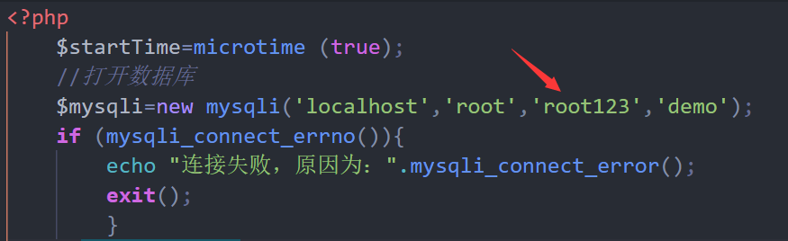

# CentOS7 基本配置
- [CentOS7 基本配置](#centos7-%E5%9F%BA%E6%9C%AC%E9%85%8D%E7%BD%AE)
    - [安装VMware：](#%E5%AE%89%E8%A3%85vmware)
    - [安装secureCRT](#%E5%AE%89%E8%A3%85securecrt)
    - [新建虚拟机并配置CentOS操作系统](#%E6%96%B0%E5%BB%BA%E8%99%9A%E6%8B%9F%E6%9C%BA%E5%B9%B6%E9%85%8D%E7%BD%AEcentos%E6%93%8D%E4%BD%9C%E7%B3%BB%E7%BB%9F)
    - [centOS中文配置](#centos%E4%B8%AD%E6%96%87%E9%85%8D%E7%BD%AE)
    - [通过修改linux编码方式为GBK/GB18030，使中文提示命令显示正常](#%E9%80%9A%E8%BF%87%E4%BF%AE%E6%94%B9linux%E7%BC%96%E7%A0%81%E6%96%B9%E5%BC%8F%E4%B8%BAgbkgb18030%E4%BD%BF%E4%B8%AD%E6%96%87%E6%8F%90%E7%A4%BA%E5%91%BD%E4%BB%A4%E6%98%BE%E7%A4%BA%E6%AD%A3%E5%B8%B8)
    - [centOS中mysql的安装以及操作](#centos%E4%B8%ADmysql%E7%9A%84%E5%AE%89%E8%A3%85%E4%BB%A5%E5%8F%8A%E6%93%8D%E4%BD%9C)
    - [修改mariaDB的字符编码为gbk，并建表输出](#%E4%BF%AE%E6%94%B9mariadb%E7%9A%84%E5%AD%97%E7%AC%A6%E7%BC%96%E7%A0%81%E4%B8%BAgbk%E5%B9%B6%E5%BB%BA%E8%A1%A8%E8%BE%93%E5%87%BA)
    - [安装php服务以及使Apache服务随开机启动，并配置php与Apache服务](#%E5%AE%89%E8%A3%85php%E6%9C%8D%E5%8A%A1%E4%BB%A5%E5%8F%8A%E4%BD%BFapache%E6%9C%8D%E5%8A%A1%E9%9A%8F%E5%BC%80%E6%9C%BA%E5%90%AF%E5%8A%A8%E5%B9%B6%E9%85%8D%E7%BD%AEphp%E4%B8%8Eapache%E6%9C%8D%E5%8A%A1)
    - [C++编译mysql测试程序](#c%E7%BC%96%E8%AF%91mysql%E6%B5%8B%E8%AF%95%E7%A8%8B%E5%BA%8F)
    - [使用flashFXP插件，使可以在centOS虚拟机、宿主机之间传输文件](#%E4%BD%BF%E7%94%A8flashfxp%E6%8F%92%E4%BB%B6%E4%BD%BF%E5%8F%AF%E4%BB%A5%E5%9C%A8centos%E8%99%9A%E6%8B%9F%E6%9C%BA%E5%AE%BF%E4%B8%BB%E6%9C%BA%E4%B9%8B%E9%97%B4%E4%BC%A0%E8%BE%93%E6%96%87%E4%BB%B6)

## 安装VMware：

- 老师采用的14.0版本的VMware，但由于上学期我已安装12.0版本的VMware，所以我不再更新软件，掠过此环节（经之后实验，12.0版本目前为止与14.0版本差别不大）

## 安装secureCRT

- 同样上学期已安装完毕，且已经熟悉了很多linux下的操作（包括vim、以及远程服务器配置、上传下载文件等操作），本环节略过

## 新建虚拟机并配置CentOS操作系统

- 与上学期老师提供已经配置好网络端口192.168.80.230的Red Hat不同的是，这次centOS没有配置，需要自行手动设置，在老师给出的安装说明中已经详细给出，此处没有留图，因此不提供截图显示。

- 但是这次遇到了一个棘手的问题，就是即使配置好了宿主机VM8网卡的端口192.168.80.0， 但是打开虚拟机以后仍然显示不能很好的连接上，如下图：


- 经查找资料，我发现原来是这个文件`/etc/sysconfig/network-scripts/`之中的配置文件`ifcfg-ens32`的一项：`ONBOOT=no`需要手动设置为`yes`，通过`vim` 打开`net-work-scripts`文件，并利用`i`或`a`进行编辑，修改完后，再用`esc`退出编辑，并输入指令`:wq` 保存并推出vim编辑器

- 最终用 `ifconfig` 查看ip如下：


- 表示网卡已生效

至此，centOS基本配置过程已结束

## centOS中文配置

- 由于最开始我安装的是英文版的操作系统（觉得英文更纯正...），但是发现老师的作业中用中文，以及要求操作系统提示语用中文显示，不得不上网寻找中文显示的方法，从网上查到的方法如下：

- 对于centOS 7.0及以上版本来说，语言设置在`/etc/locale.conf`这个配置文件中，


- 用vim locale.conf 修改LANG属性（下面的截图已经修改为中文）


- 可以中英文互相转换,下图设置英文 


- 此时为英文状态

- 此外我查到有另外的方法可以直接修改语言：直接在命令行输入`LANG='xxx'`;可以修改系统语言，利用`echo $LANG`命令可以查看当前语言


- 从图中可以看到，由中文utf-8编码，改编为英文utf-8编码
通过观察，发现中文提示符出现乱码的情况


## 通过修改linux编码方式为GBK/GB18030，使中文提示命令显示正常

- 输入命令`locale Ca`查看所有已经安装的语言包，中文语言包有如下：


- 根据要求，通过上述命令改选为`zh_CN.gbk`观察结果


- 已经可以成功将中文显示！

## centOS中mysql的安装以及操作

- 查了好久..终于找到了mariaDB的启动方式：
```
systemctl start mariadb.service
```
- 设置启动项，添加mysql至开机启动

```
systemctl enable mariadb.service
```
- 另外停止mysql服务为
```
systemctl stop mariadb.service
```


## 修改mariaDB的字符编码为gbk，并建表输出

- 在/etc/my.cnf这个文件中加入红色表示出来的设置语句


- 通过进入数据库后输入 status指令，查看当前数据库状态：


- 可观察到无论服务端还是数据库还有客户端编码都设置成了gbk

- 通过 `show databases`； 的操作发现数据库列表中没有demo数据库


- 通过 `create database demo`；创建数据库


- 通过`use demo`；进入数据库demo


- 先通过`drop XX if exists ..` 删除旧表，然后通过`create table student`；建立数据表`student`


- show tables结果显示新数据表被建立


- 插入四条数据：


- 通过`select * from student`；选择所有内容查看student表中信息，如下图所示


## 安装php服务以及使Apache服务随开机启动，并配置php与Apache服务

- 首先关闭虚拟机防火墙以及Selinux：


- 修改config文件，使`selinux=disabled`


- 配置使centOS可以链接外网：（参考了大佬的文章：[https://blog.csdn.net/zhaolimin66 66/article/details/52897198](https://blog.csdn.net/zhaolimin66%2066/article/details/52897198)）


- 图为成功ping到百度链接后的返回

- 通过`system control`命令开启Apache服务


- 在浏览器中输入虚拟机ip，可检测Apache服务是否正常


- 安装PHP服务


- 用`yum`命令安装PHP常用拓展


- 之后重启Apache


- 用mv指令改变文件名称 `-> demo.php`


- 进入`/etc/httpd/conf` 的 `httpd.conf`文件 修改如下


- 设置默认字符为gbk


- 由于修改了`httpd.conf`, 一定要刷新一下apache 的service


- 其中一定注意更改php代码，进入数据库的参数..重新设置密码：


- 将箭头处的密码值改成自己的root数据库的密码

- 这时再进入`192.168.80.230`


- 可观察到正确结果

## C++编译mysql测试程序

- 此前都是通过外网安装的服务，这次通过`mount` iso然后通过iso安装：

- 先将cdrom 挂载到mnt


- 使用`df Ch`指令，观察/mnt挂载成功（此时mnt 目录下有文件） 每次boot后均需要重新挂载一次


- 然后进入 `/etc/yum.repos.d` 目录下，修改 除CentOS-Media.repo以外的文件的文件名，使其网络源无效


- 打开CentOS-Media.rep，如图将baseurl注释，更改为`file:///mnt`， 再使`enabled = 1`，至此实现了通过iso方式安装


- 安装mysql依赖


- 从网上了解到：

`--libs`选项 是链接mysql函数库， 执行`mysql_config Clibs`选项


`--cflags`选项 是使用必要的include文件


- C++文件还要记得修改密码


- 否则会出现下图情况


- 使用g++ 编译cpp 到可执行文件：

    - 方法一： 不通过makefile

        输入`g++ $(mysql\_config --cflags) demo.cpp $(mysql\_config --libs) -o out` 指令，编译
        
        `-I`为编译程序按照-I指定的路进去搜索头文件  
        `-L`为编译程序按照-L指定的路进去寻找库文件

        运行 out，得到最终结果
        

    - 方法二：通过写makefile 文件

        没过..不知道为什么

## 使用flashFXP插件，使可以在centOS虚拟机、宿主机之间传输文件
- 解压后，F4（或sites/site Manager）调出网站管理器，设置如下


- 注意要用SFTP连接方式）发现链接失败...


- 记得更改Flashfxp的编码方式


- 链接成功后传送文件


- 成功显示无乱码的文件名

