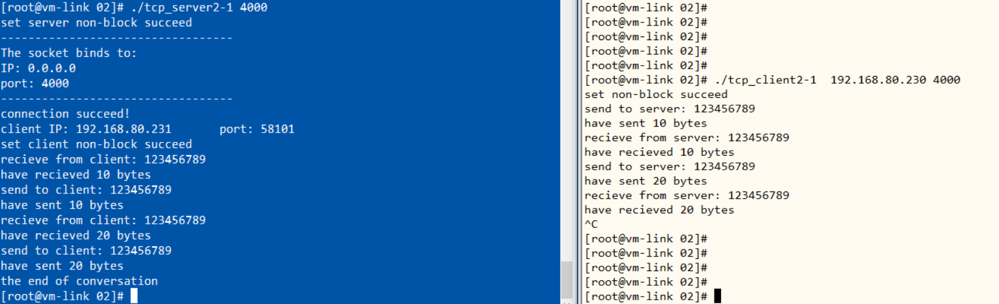
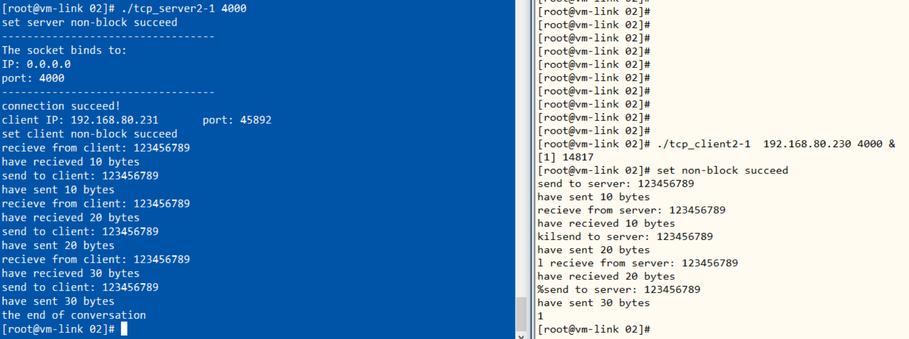

<meta charset="utf-8" lang="en">

**Socket编程 TCP非阻塞方式**
    1651574 贾昊霖

# socket的阻塞和非阻塞

## 基本概念

### 阻塞IO

必须要做完IO 操作（包括错误）才会返回

### 非阻塞IO

无论操作是否完成都会立刻返回，需要通过其他方式来判断具体操作是否成功（对于connect，accpet操作，通过select判断，对于recv，recvfrom，send，sendto通过返回值+错误码来判断）

## 阻塞与非阻塞设置

### 非阻塞模式设置

## 非阻塞函数

### select()

select函数是一个循环函数，监视多个文件描述符上发生的事件(可读、可写、可读可写、异常)。因此可实现非阻塞编程

- nfds: 一个整数值, 所有文件描述符的最大值加1

- readfds: 用来检查一组可读性的文件描述符，若不检查可用NULL

- writefds: 用来检查一组可写性的文件描述符，若不检查可用NULL

- exceptfds: 用来检查文件文件描述符是否异常，若不检查可用NULL

- timeout: 时间结构体，用来设置超时时间，最多等待时间，对阻塞操作则为NULL

- 返回值：
    - 负值：select错误
    - 正值：表示读写文件的数量
    - 0：等待超过timeout时限，指无任何事件发生时

!!!
    若有读写事件发生，则select立即返回

- FD_ZERO(fd_set *set): 将文件描述符set集合清空

- FD_SET(int fd, fd_set *set): 将fd加入到文件描述符set集合中

- FD_CLR(int fd, fd_set *set): 将fd从文件描述符set集合中清除

- FD_ISSET(int fd, fd_set *set): 测试文件描述符set集合中的fd，即测试fd对应的文件描述符有没有数据可读/可写/异常

# Socket非阻塞测试

## connect成功后，设置非阻塞，并测试服务端客户端非阻塞recv

服务端以以下方式接收

输出结果如下

## connect成功后，设置非阻塞，并测试服务端客户端使用select非阻塞编程

将select等待时间设为3s

通过select的时间参数设置为NULL，将程序设置为阻塞，因此程序可以按阻塞读取方式收发数据

!!! Warning
    注意每次select后wait_time都会减少，所以每次都要重新设置时间

## 立即设置非阻塞，之后测试服务端客户端使用select非阻塞编程

在socket建立后立刻设置非阻塞，发现一切正常，其他隐藏问题待发现！

# Socket非阻塞终端测试

## client发数据，server收数据

## CTRL+C client中断测试

将客户端数据发送段代码更改如下:

!!! Warning
    如果这里的send每次发送的长度 > 接收的长度，而客户端又是在while(true)循环中，则会大量地循环直到接受完成

经分析，当使用CTRL+C中断客户端时，select()仍能返回正数，但是recv()会返回错误-1

结果如下:

## kill client中断测试

使用`&`使客户端运行在后台，然后通过`kill %1 杀死`

结果和用CTRL+C中断相同

<!-Markdeep: -->

 
